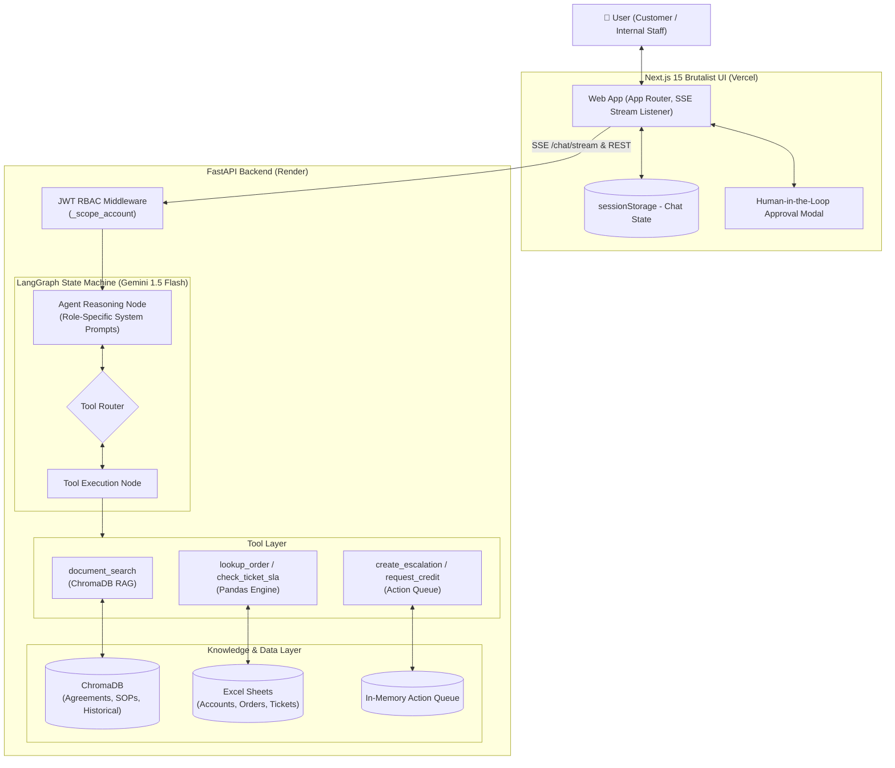

# 🏛️ ParcelPilot AI — System Architecture Note

This document details the architectural design, tool abstractions, data handling strategies, source precedence rules, and technical trade-offs implemented in ParcelPilot AI.

---

## 📐 System Architecture Diagram



### ASCII Architecture Overview

```
+-----------------------------------------------------------------------------------+
|                            NEXT.JS 15 FRONTEND (VERCEL)                           |
|  - Dual-Persona Interface (Customer / Internal)   - Real-Time SSE Stream Consumer |
|  - Animated Reasoning & Tool Execution Pipeline   - Human-in-the-Loop Action Modal|
+-----------------------------------------+-----------------------------------------+
                                          | (JWT Bearer Token + SSE)
                                          v
+-----------------------------------------------------------------------------------+
|                            FASTAPI BACKEND (RENDER)                               |
|  - RBAC & Tenant Scoping Middleware (_scope_account)                              |
|  - Snapshot Reference Time Engine: 2026-08-16T11:00:00+05:30                      |
+-----------------------------------------+-----------------------------------------+
                                          |
                                          v
+-----------------------------------------------------------------------------------+
|                 LANGGRAPH REASONING ENGINE (GOOGLE GEMINI)                        |
|                                                                                   |
|      [User Input] --> [Agent Reasoning Node] <---> [Conditional Tool Router]      |
|                              |                                |                   |
|                   (Role Prompts Injected)           (Multi-Step Loops)            |
+------------------------------+--------------------------------+-------------------+
                               |
       +-----------------------+-----------------------+
       |                                               |
       v                                               v
+-----------------------------+                 +-----------------------------+
|    RAG RETRIEVAL ENGINE     |                 |   STRUCTURED DATA ENGINE    |
| - ChromaDB Vector Store     |                 | - In-Memory Pandas Engine   |
| - Tiered Metadata:          |                 | - Deterministic Business    |
|   * Tier 1: Agreements      |                 |   Rules (SLA, Fee Math)     |
|   * Tier 2: Active SOPs     |                 | - Role Scoping Enforced     |
|   * Tier 4: Deprecated SOPs |                 | - Account Isolation         |
|   * Tier 5: Past Tickets    |                 +-----------------------------+
+-----------------------------+                                |
       |                                                       v
       +-----------------------------------> +--------------------------------+
                                             |  HUMAN-IN-THE-LOOP ACTION QUEUE|
                                             | - Staged Financial / Mutative  |
                                             |   Actions (Pending Approval)   |
                                             +--------------------------------+
```

---

## 1. 🧠 Agent Design
The system uses a **LangGraph-based state machine** driven by the `gemini-1.5-flash` model. 
- **Cyclic Multi-Step Reasoning**: LangGraph enables cyclic execution, allowing the agent to call a tool, parse the result, invoke additional tools (e.g. first checking customer tier, then searching the agreement, then computing cancellation eligibility), and finally synthesize an authoritative answer.
- **Context Segregation**: The agent dynamically injects different system prompts based on the user's role:
  - **Customer Prompt**: Strictly constrained to customer-visible information, privacy-preserving, and polite.
  - **Internal Staff Prompt**: Analytical, uncovers source conflicts, cites reliability tiers, and audits historical ticket mistakes.
- **Snapshot Time Grounding**: `DATASET_SNAPSHOT` (`2026-08-16T11:00:00+05:30`) is explicitly bound to the agent prompt as "current time" to ensure reproducible date and SLA calculations.

---

## 2. 🛠️ Tool Design
The agent uses three primary tool classes:
1. **Document Search (`document_search`)**: Queries ChromaDB using cosine similarity over markdown embeddings. Returns chunks enriched with metadata (`source`, `reliability_tier`, `effective_date`, `account_id`).
2. **Deterministic Data Lookup & Calculation**:
   - `lookup_order`, `lookup_account`, `lookup_tickets`, `list_orders`
   - `calculate_cancellation`: Applies agreement overrides (e.g., Northstar INR 0 fee) before falling back to SOP v4 rules.
   - `calculate_service_credit`: Tests carrier fault, customer fault, and delay thresholds (e.g. LumenWorks 4h vs default 2h).
   - `check_ticket_sla`: Evaluates ticket elapsed time against plan targets (Enterprise P1 = 15m vs Standard = 240m).
3. **State-Changing Actions (`create_escalation`, `request_order_cancellation`, `request_service_credit`)**:
   - Instead of mutating production data immediately, these tools push a `PENDING` action record into the server queue.
   - The frontend renders an interactive **Action Modal** allowing human operators to inspect and approve the change.

---

## 3. 📂 Document and Structured-Data Handling
- **Tenant Scoping at Data Layer**: Access control is enforced in Python code (`_scope_account()`), not solely by LLM prompt steering. If a customer queries an order belonging to another company, the data access layer returns `None / Not Found`.
- **Hybrid Retrieval Strategy**: Semantic search retrieves legal nuance and policy phrasing, while the deterministic Pandas layer executes exact mathematical formulas and date calculations.

---

## 4. 🛡️ Source Reliability & Conflict Handling (Trust Engine)
To solve the trust and hallucination problem, all documents are assigned an explicit **Reliability Tier**:
- **Tier 1 (HIGHEST)**: Signed Customer Enterprise Agreements (e.g. Northstar, LumenWorks).
- **Tier 2 (HIGH)**: Current Standard Operating Procedures (e.g. SOP v4).
- **Tier 3 (MEDIUM)**: General Policies & Knowledge Base articles.
- **Tier 4 (DEPRECATED)**: Superseded SOPs (e.g. SOP v2, SOP v3).
- **Tier 5 (LOW / CONTEXT ONLY)**: Historical Support Tickets.

### Conflict Resolution Strategy:
1. **Precedence Enforcement**: `Signed Agreement > Active SOP > General Policy > Deprecated SOP`.
2. **Historical Ticket Flagging**: When a historical resolution (e.g., `TKT-450` where an agent mistakenly charged a fee) contradicts a higher-tier contract, the agent explicitly flags the past ticket as **erroneous** rather than blindly repeating the mistake.
3. **Transparent Citations**: Every response quotes the exact document title, section, and reliability tier.

---

## 5. ⚖️ Major Technical Trade-offs

| Decision | Chosen Approach | Alternative Considered | Rationale |
|---|---|---|---|
| **Agent Orchestration** | LangGraph StateGraph | Linear Chain / ReAct loop | Allows cyclical multi-tool reasoning and clean conditional edge routing. |
| **Business Logic Math** | Deterministic Python Tools | Direct LLM Math in prompt | LLMs frequently make arithmetic and date calculation errors; Python tools guarantee 100% precision. |
| **Security Layer** | Data-layer Tenant Scoping | LLM System Prompt Scoping | System prompts can be bypassed with prompt injection; Python-level filtering is mathematically airtight. |
| **Mutative Actions** | Staged Approval Queue | Autonomous Execution | Critical financial and operational actions require human verification to prevent accidental execution. |
| **Storage Architecture** | Pandas + ChromaDB | PostgreSQL + Pinecone | Kept the solution completely self-contained, lightning-fast to boot, and portable for evaluation. |

